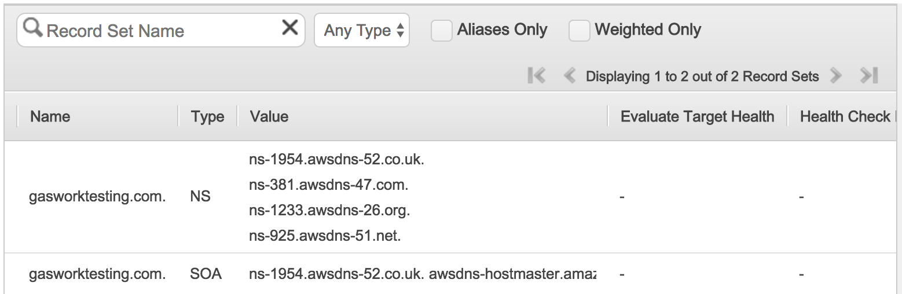
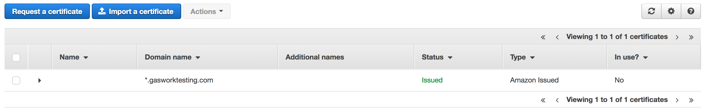

# General Structure

I first walk you through creating the kops cluster and then setting up the prerequisites the API. Then I go through putting the demo API online and end with my notes on how to setup GitLab (if you didn't make the PostgREST image on your own computer).

I pulled the monitoring from the project, it just never really gave me back reliable numbers (because of some config issues I had). I would really need another week to get that working properly, so I cut it out.

Notes to future me: helm for deploying heapster (for auto scaling) kept having strange issues. Try deploying it manually next time.

Also, you need to change the secretes in the env file, this whole project is being saved online.

# Global Environment Variables

The environment variables are assumed to be present when any of the commands in this document are run.

I wrote an script called env that describes all of the environment variables and should be sourced before running any of the commands below.

# Deployment of the K8 cluster on AWS

When you run this, you have no idea if it will work. No this is not because I set this up wrong or did not test it well enough. Simply put, I can run the exact same steps and get different outcomes. I'm not sure what magic is going on at AWS or even with the tools I use. If it does not work, just try it again and it might work Which is why I do not provide a script or Makefile to deploy a cluster.

This section goes through how to deploy a k8 cluster on AWS. There are three sections. The Pre-requisites goes through everything you need to do before calling `kops`, which sets up the actual cluster on AWS. Deployment with Kops is how to invoke `kops`. Validation goes though the steps involved with checking that the deployment is ready for production use.  

## Pre-requisites

Keep in mind that without an account, none of the other steps can be done. Although you can install the tools beforehand.

### Create AWS account

You can get free credit for an AWS account by getting access to the github student pack bundle. I think they will let academics also use their uni email to get some free credit.

After account creation, you can begin the next steps

### Create IAM role on AWS

After you create your account you have credentials to what is considered the master of the account, but in general you don't need that kind of power. So instead AWS has IAM that lets you create roles with restricted privileges. Back when I first created my AWS account IAM took you through a wizard to create your administrator account which you should always use instead of the master.

Once you have done that, go ahead and create access keys for the admin account from the IAM console. You will need them to setup the aws tool. 

### Local Tools

Note: You need to have the same version of kubectl on both client and server or things don't work nicely. You can download the version I used [here](https://github.com/kubernetes/kubernetes/releases/download/v1.6.2/kubernetes.tar.gz) while the download page is [here](https://github.com/kubernetes/kubernetes/releases?after=v1.5.7).

After you deploy you can run `kubectl version` to find out what version `kops` has deployed. Not sure how to ask `kops` before deployment.

#### aws tool

This install commands assume you have `brew` installed. If not go ahead and go to their website for install instructions. 

To install aws you can use `pip` if you are not on a mac, otherwise just use `brew`.

```
brew install awscli
```

The version this project tested with is: `aws-cli/1.11.89 Python/2.7.10 Darwin/16.5.0 botocore/1.5.52`

To configure it with your credentials run:

```
aws configure
```

#### kubectl tool

Please see the online docs: [kubectl install instructinos](https://kubernetes.io/docs/tasks/tools/install-kubectl/).

The version that this project tested with is: 

```
Client Version: version.Info
{
  Major:"1", 
  Minor:"6", 
  GitVersion:"v1.6.4", 
  GitCommit:"d6f433224538d4f9ca2f7ae19b252e6fcb66a3ae", 
  GitTreeState:"clean", 
  BuildDate:"2017-05-19T20:41:24Z", 
  GoVersion:"go1.8.1", 
  Compiler:"gc", 
  Platform:"darwin/amd64"
}
```

#### kops tool

Your AWS Acces Key ID and AWS Secret Access Key come from the access key you got from the previous step. The default region is not important, but you can set to ap-northeast-2. However, it is important to set the default output format to json. Some of the scripts rely on that aspect.

Next you need to install `kops`, either by downloading a release or running

```
brew install kops
```

The version this project was tested with is: `Version 1.6.0`

#### jp

I used `jp` version 0.1.1

It is a way to filter json objects that I think is superior to `jq`, but I did not know about it at the start of the project. So unfortunately I use both... 

```
brew tap jmespath/jmespath
brew install jp
```

#### jq

I used `jq` version-1.5

```
brew install jq
```

If I get time I would replace this with jp.

### Domain on AWS

You need to have a domain registered on Route53 in AWS. This domain is used for both ingress into the k8 cluster and internal communication in the cluster, so you need to have one before you can deploy the cluster. In the route53 interface they give you an option to both buy a domain and have it automatically managed by them.



The next setup is to create certificates for the domain. Us the AWS Certificate Manager to create a wild card certificate for the domain. This is important since we need to create a variable number of sub domains, all of which need a valid certificate. You can use something like lets encrypt, but that would mean you need to generate a certificate for each subdomain.

### SSH keypair

Next you need to upload your rsa public key to AWS so `kops` can put in on the actual virtual machines it will create. To create a new key:

```
ssh-keygen -t rsa -b 4096 -f k8-$REGION.pem
```

Note: I like to call the key the name of the region, example: k8s-ap-southeast-2

You can upload your public key in the EC2 service under Key Pairs.

### S3 Bucket

`kops` needs an S3 bucket to store the `terraform` code and k8 config files. 

```
aws s3 mb $BUCKET --region $REGION 
```

## Deployment with Kops 

You will need to source the environment variables in the same shell you run this command in:

Note: This command will replace your ~/.kube/config file. So if you have previously setup minicube, you will lose your credentials.

```
kops create cluster \
			--yes \
			--zones $ZONES \
			--ssh-public-key $PUBLIC_KEY_PATH \
			$NAME
```

You might get this kind of error:

```
error determining default DNS zone: No matching hosted zones found for "<your url>"; 
please create one (e.g. "<your url>") first
```

I have no idea why this happens, but if you deploy the cluster again, a few times, it just works.

To delete the cluster, say if something goes wrong like above, run this:

```
kops delete cluster --yes $NAME
```

Note: sometimes you need to delete the cluster even if nothing actually deployed. Not really sure what state is kept when `kops` fails, but it can prevent `kops` from working correctly.

## Validation

Validation is done by running:

```
kops validate cluster $NAME
```

That command outputs a few others that you can try. However, you need to wait quite awhile before they will tell you the cluster works. For me it took about 20min before the cluster was ready to respond. So if it does not work, just wait. For example if you see:

```
cannot get nodes for "<your url>": 
Get https://api.<your url>/api/v1/nodes: dial tcp <some ip>:443: i/o timeout
```

Then may mean your cluster is not yet setup and you just need to wait or everything is broken and you will have no idea why.

## Docker repository 

You need to have some repository for k8 to pull off of. I set one up on AWS in ap-southeast-2, since my cluster is there. Once you have set the `DOCKER_REPO` environment variable to the base URI.

The Makefiles assumes that there is a swagger-ui and postgrest repository under the base URI.

# Deploying services on k8

These tend to be a lot more predictable. Either they work flawlessly or throw sometimes useful errors. As such I have put them in Makefiles to speed up deployment and reversals. I will go into detail about how each one works, but at the start of each section I have a summary of just the commands you need to run to deploy that part.

I created a make file to illustrate the parts, but the problem is some of the commands take time after they have completed to finish the operation on the k8 cluster. Makefiles are really poor man's automation tool. So I have used the Makefile where appropriate, but you don't get to just run `make`. Out of scope of this project, but I need to find a better build tool.

Each of these sections should be done in order. You need to deploy the ingress (Default-backend service and Nginx/Warp) first, then comes postgresql, then sqitch and finally the PostgREST service.

## K8 dashboard

To check if it is installed run:

```
kubectl get pods --all-namespaces | grep dashboard
```

If not run:

```
kubectl create -f https://git.io/kube-dashboard
```

Note: in the version of `kpos` I use you have to create the dashboard manually.

## Default-backend service and Nginx/Warp

This is the service that handles load-balancing and internal routing. It creates the Elastic Load Balancer which all traffic goes through. This is important since that load balancer handles the certificates. Plus this also has the default backend which is part of the internal routing.

The service is split access two different deployments and services, one is the Nginx/warp instance and the other is a image from google. This means the `nginx-ingress-controller-deployment.yaml' is actually made up of two images, the Nginx and the Wrap image. The `nginx-ingress-controller-service.yaml` creates the load balancer with the certs on AWS. While the 'default-backend-deployment.yaml` and `default-backend-service.yaml` is responsible for internal routing.

Note: Services in k8 are how other services "discover" each other. It provides an abstracted view of what a deployment does.

Note: The Nginx might need some changes to the config so swagger-ui works correctly. As of now I can only get swagger-ui to accept the swagger spec from PostgREST if it is run locally.

Note: The Warp instance's purpose is to force ssl, it redirects all HTTP traffic to HTTPS.

Note: find out if when you send a request with a password over HTTP, does the request get rejected before the password is sent?

Note: The traffic between the ELB and the rest of the cluster should be in HTTP, I think I have taken the necessary precautions, but I should ask about it when I get the chance.

Note: The reason why there is a Dockerfile in that repo is so that I could modify the nginx to add the required CORS headers, but I was not successful. There is a program on the nginx-ingress-controller image that creates the nginx.conf when an ingress rule is created in k8. I would need to figure out how that works to actually add in the needed headers. The nginx.conf file in the repo has the headers I think swagger-ui wants. 

### Setup

You have to lookup the arn in the AWS Certificate Manager online:

.

Once you get to the place in the image above click on your cert and in the drop down you will see the ARN. Put that into your `env` file as `SSL_CERT_ARN`.

### Summary of deployment commands

To Deploy, in the k8/ingress directory run:

```
make
```

To remove, in the same directory run:

```
make clean
```

## Postgresql

This uses the `helm` tool to deploy a postgresql cluster on the k8 cluster. So you need to install [helm from here](https://helm.sh/). 

I am on version:

```
Client: &version.Version 
{
  SemVer:"v2.4.2", 
  GitCommit:"82d8e9498d96535cc6787a6a9194a76161d29b4c", 
  GitTreeState:"clean"
}
```

Essentially `helm` is taking in the values.yaml in the k8/postgresql repo to make the postgresql cluster. The password is generated for us and the other make files use `kubectl` to get it for you.

### Summary of deployment commands

In the k8/postgresql folder run, after you have sourced your env file:

```
make setup
```

followed by

```
make
```

## Sqitch

This is the demo structure I created for PostgREST to serve up. You will need to run it before PostgREST can get access to the database (since it sets the access passwords and roles).

Just run:

```
make setup
make
```

The setup will forward a local port to the postgresql instance so Sqitch can access the database. I assume that you have done nothing more the instructions I have given. The Makefiles know how to both get the credentials and figure out the names of the pods.

## PostgREST

This one has a few pain points. The reason I started using environment variables in the first place was so I could deploy different versions of PostgREST, but the result is quite clumsy. If you want to deploy say `v1` you set the `DBSCHEMA` environment variable to 'v1'. When you run `make` in the k8/PostgREST folder it will create a new deployment, service, ingress and url to access a PostgREST instance that access the schema v1. If you want to remove that version you run `make clean` and its all removed for you, but if you want to remove say version `v2` you have to switch the environment variable to `v2` before you can remove it.

This is a problem with this since `make clean` is only going to remove the version with the corresponding `DBSCHEMA`. In reality I need to have a configuration file for each version that is handled separately. I think `helm` may be able to fill that role, but that is beyond the scope of this project.

There is another part to keep in mind: all instances use the same `JWT_SECRET`, `DBURI` connection and the anonymous role is hard coded to be anon concatenated with `DBSCHEMA`. So you have to make sure in the sqitch files that the authenticator role can switch to each anonymous role, that each role gets access to the group types for each version (in fact when creating a new version you need to grant all existing roles with any new group types that they should be a part of) and make sure the anonymous role follows the pattern anonDBSCHEMA (example anonv1). Of course the only parts that the PostgREST instance can see are whatever is in the schema `DBSCHEMA`.

Note: the `AWS_HOST_ID` env uses `DOMAINNAME` to figure out which of the `hostedZones` is the right one. Just make sure the `DOMAINNAME` is only the domain. For example: gasworktesting **NOT** gasworktesting.com

Note: The `ELB` env variable is filled with the first elastic load balancer it finds. I might be able to do something where I ask k8 what vpc the cluster is in and use that to filter the results, but for now just keep this is mind.

### Pre-requisites

The k8/PostgREST repo just has the deployment scrips, the PostgREST image itself you need to have on a docker registry where k8 can access it. I used the AWS's docker hub registry to host the image and GitLab-runner to build the image / upload the image. I have a separate repository that is a fork of PostgREST with my preliminary work for deploying the service, deployment images, build images and GitLab-runner's configuration. There is a Makefile that shows you how to upload the image from your local machine, but you have to build the docker image on linux for that to work. If you want to setup the GitLab-runner as I have, please see that section.

Then you will need to update the `GIT_REVISION_POSTGREST` environment variable.

In the PostgREST repo I have my fork that I built the PostgREST image with. Please see that repo for details on how to build the image.

### Summary of deployment commands

To deploy version 1, set DBSCHEMA to `v1` in your env script and run:

```
make
```

To remove run:

```
make clean
```

To access go to [here](v1postgrest.gasworktesting.com) and you will get the swagger spec.

## Swagger-UI

Very similar to the way PostgREST is setup. The version is also handled with DBSCHEMA env variable. So to deploy the version 1 of swagger-ui you just need to have set DBSCHEMA to v1. Then:

```
make
```

And to remove (while having the DBSCHEMA set to v1)

```
make clean
```

Then to access go [here](https://v1swagger-ui.gasworktesting.com/). If you also created version 2 then the swagger-ui would be [here](https://v2swagger-ui.gasworktesting.com/). 

# GitLab-runner

Here are my notes are setting up the GitLab-runner and other instructions I needed.

* Launch a new machine on AWS w/ 4GB RAM

  - [ ] It should have the same zone as your repositories

  - [ ] It should be an Ubuntu 16.04 LTS AMI

* Update & Upgrade and use 4.8 Kernel (GHC problems otherwise)

```
apt-get update
apt-get -y upgrade
apt-get -y dist-upgrade
apt-get -y install \
        linux-signed-image-4.8.0-46-generic \
        linux-image-extra-4.8.0-46-generic \
        linux-headers-4.8.0-46-generic \
        linux-tools-4.8.0-46-generic
reboot
```

* Install stack

```
curl -sSL https://get.haskellstack.org/ | sh
```

* Install make (or just build-essential)

```
apt-get -y install build-essential
```

* Install the AWS CLI

```
apt-get -y install python-pip
pip install --system awscli
```

* Install gitlab-runner
  https://docs.gitlab.com/runner/install/linux-repository.html

  - [ ] Install Docker
    ```
      curl -sSL https://get.docker.com/ | sh
    ```

  - [ ] Install gitlab runner
    ```
    curl -L https://packages.gitlab.com/install/repositories/runner/gitlab-ci-multi-runner/script.deb.sh | bash
    cat > /etc/apt/preferences.d/pin-gitlab-runner.pref <<EOF
    Explanation: Prefer GitLab provided packages over the Debian native ones
    Package: gitlab-ci-multi-runner
    Pin: origin packages.gitlab.com
    Pin-Priority: 1001
    EOF
    apt-get update
    apt-get -y install gitlab-ci-multi-runner
    usermod -a -G docker gitlab-runner
    ```

* Configure gitlab-runner

  You'll need the url & token from the gitlab website (under Settings -> CI/CD
  Pipelines). Choose the shell runner.
  ```
    gitlab-ci-multi-runner register
    systemctl restart gitlab-runner
  ```

* Steps to secure the server

  In the AWS security group set Http and Https inbound to only accept 
  connections from gitlab (172.31.20.160/32). Then turn on ufw logging 
  to get the ip address

  I also restricted ssh to my ip adress

  Note: there are enviroment variables that GitLab can set, lookinto
  later.

* Fixing: "Your Authorization Token has expired"

  - run `aws configure` and give it the GitLab_Docker_Repo credentials
